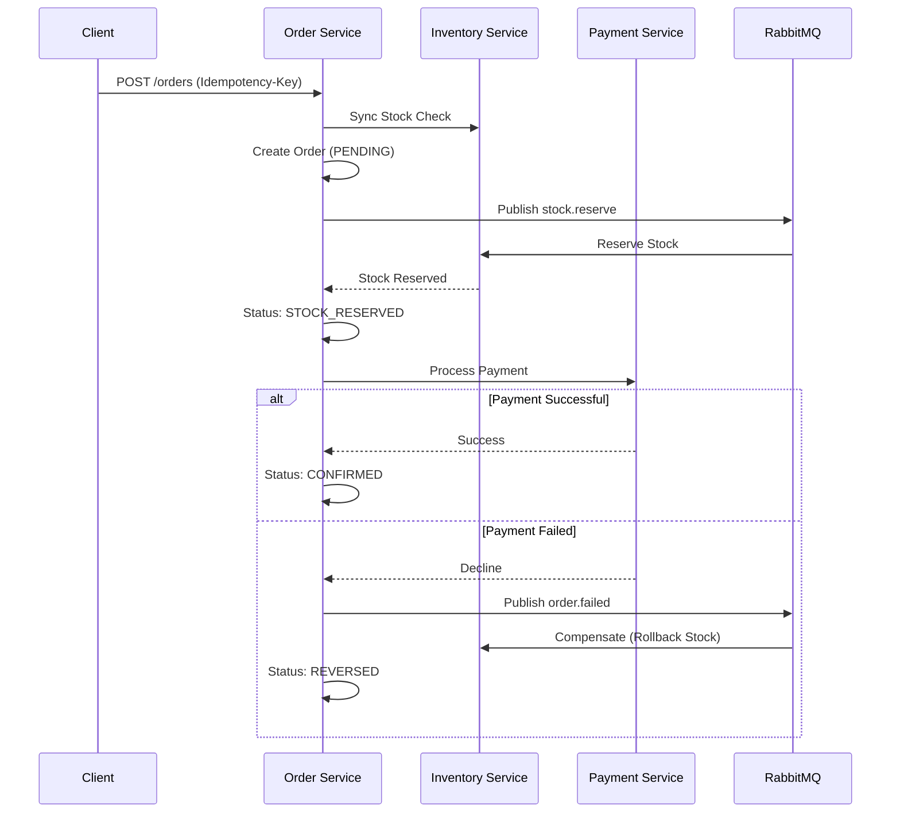

# Order Orchestration Service


> **The transactional heart of the e-commerce platform.** Handles order lifecycle, distributed saga orchestration, and failover compensation.

## ⚡️ Key Features

*   **Saga Orchestration:** Manages distributed transactions across Inventory, Payment, and Shipping services.
*   **Automatic Compensation:** Self-healing architecture that rolls back stock reservations upon payment failure.
*   **State Machine:** Deterministic order lifecycle tracking (`PENDING` -> `RESERVED` -> `PAID` -> `CONFIRMED`).
*   **Event-Driven:** Async communication via RabbitMQ (`order.events` topic exchange).
*   **Production Ready:** Includes idempotency keys, health checks, and structured logging (Winston).

---

## 🏗 Architecture

The service implements the **Database-per-Service** and **Saga** patterns.



---

## 🚀 Quick Start

### 1. Requirements
*   **Runtime:** Node.js 18+
*   **Infrastructure:** PostgreSQL, RabbitMQ (managed via Docker Compose)

### 2. Run with Docker (Recommended)
```bash
# Start full stack
podman-compose up -d order-service

# Follow logs
podman logs -f order_service_app
```

### 3. Manual Setup
```bash
cp .env.example .env
npm install
npm run migrate
npm run dev
```

---

## 🔌 API Reference

### Core Endpoints

| Method | Endpoint | Description |
| :--- | :--- | :--- |
| `POST` | `/api/orders` | **Create Order.** Requires `Idempotency-Key` header. |
| `GET` | `/api/orders/:id` | **Get Order.** Includes current Saga state. |
| `PATCH` | `/api/orders/:id/status` | **Update Status.** Admin override. |

### Testing & Debugging (Dev Only)

| Method | Endpoint | Description |
| :--- | :--- | :--- |
| `POST` | `/:id/pay` | **Mock Payment.** random 30% failure rate to test rollbacks. |

---

## 📂 Project Structure

```text
src/
├── saga/              # orchestrator.js (Saga Logic)
├── messaging/         # rabbitmqPublisher.js (Event Bus)
├── models/            # Sequelize Definitions
├── controllers/       # HTTP Handlers
└── middleware/        # Idempotency & Auth
```
